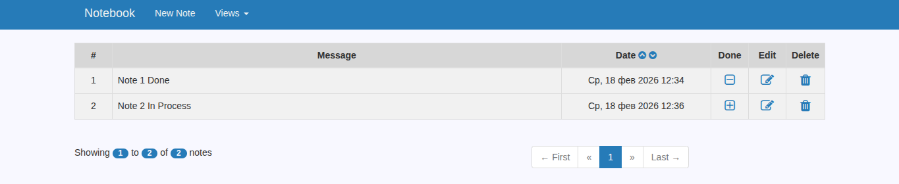
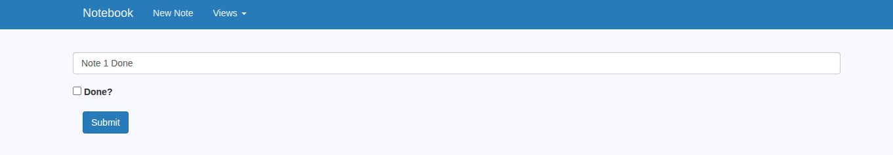

# TODO-"записная книжка" из JavaRush.
CRUD приложение использует Spring Boot и движок шаблонов Thymeleaf. 
Данные хранятся в базе MySQL, обмен проходит 
с помощью query-запросов и организует фильтрацию, сортировку по значениям, 
регулируемую с помощью элементов управления в пользовательском интерфейсе.

- Использован template Thymeleaf (очень симпатичный Bootstrap интерфейс с доработанным css). 
- Постраничная навигация. 
- Редактирование записи.
- Переход по страницам.

